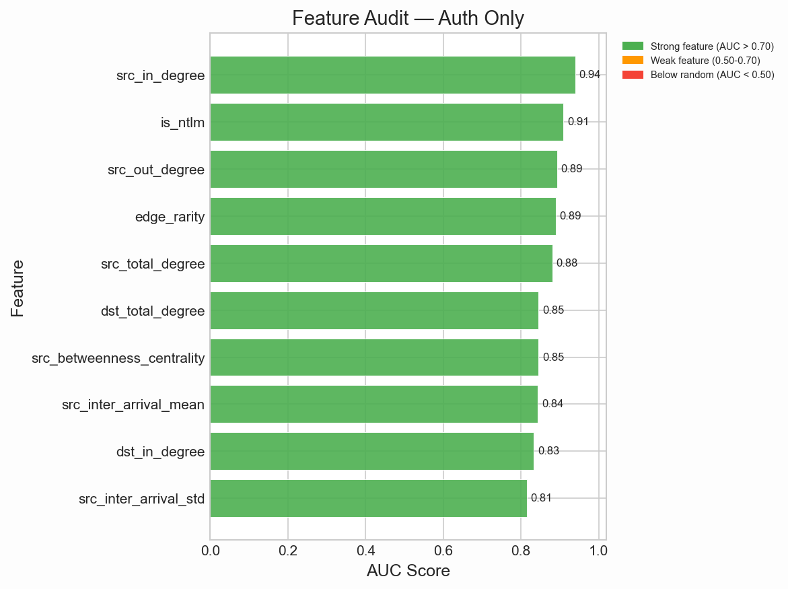
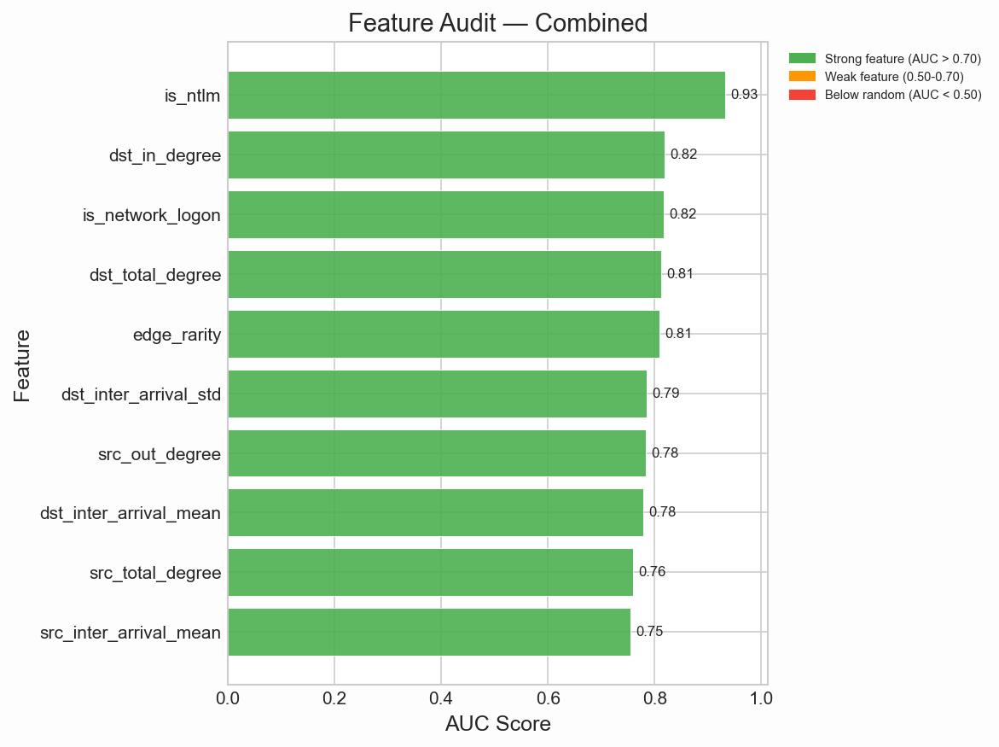
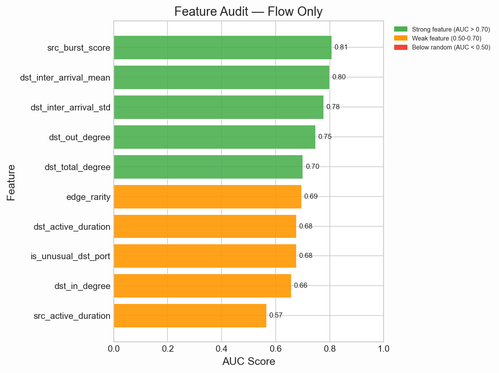
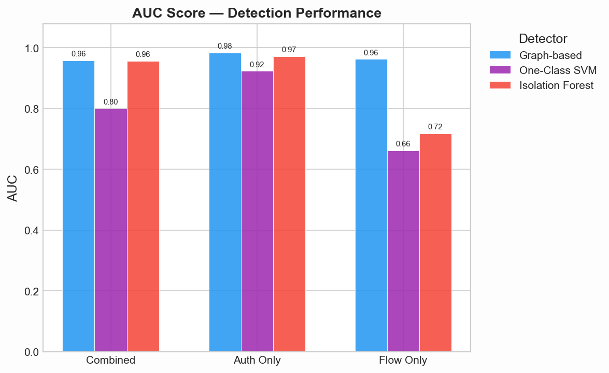
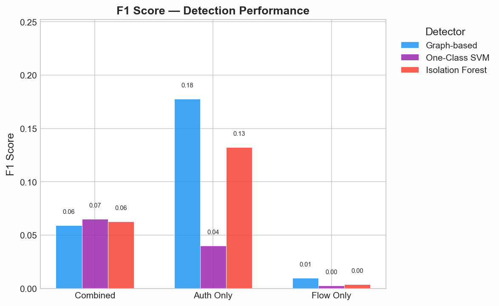
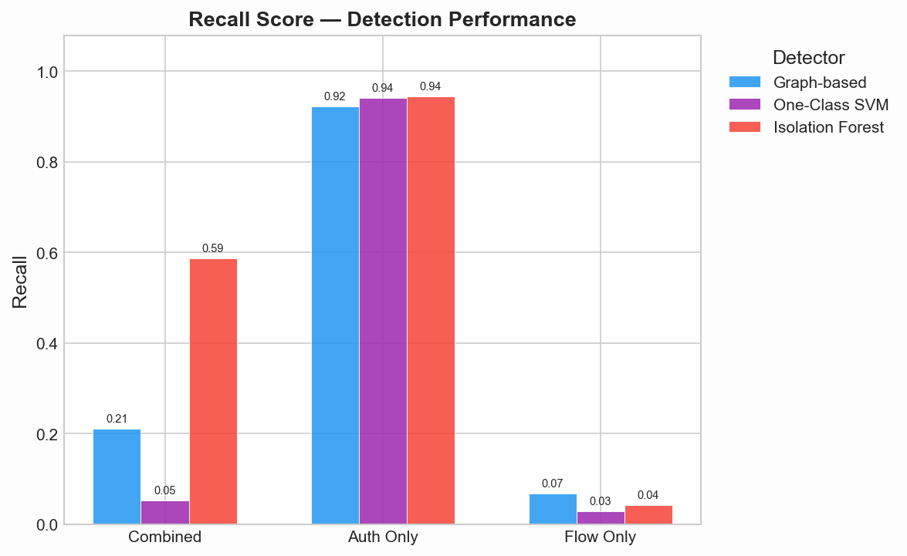
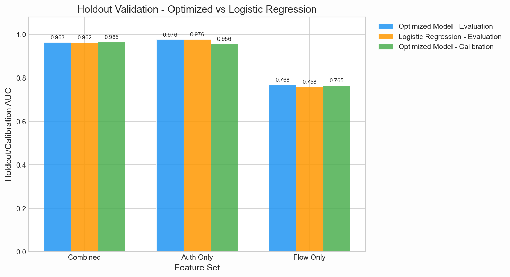
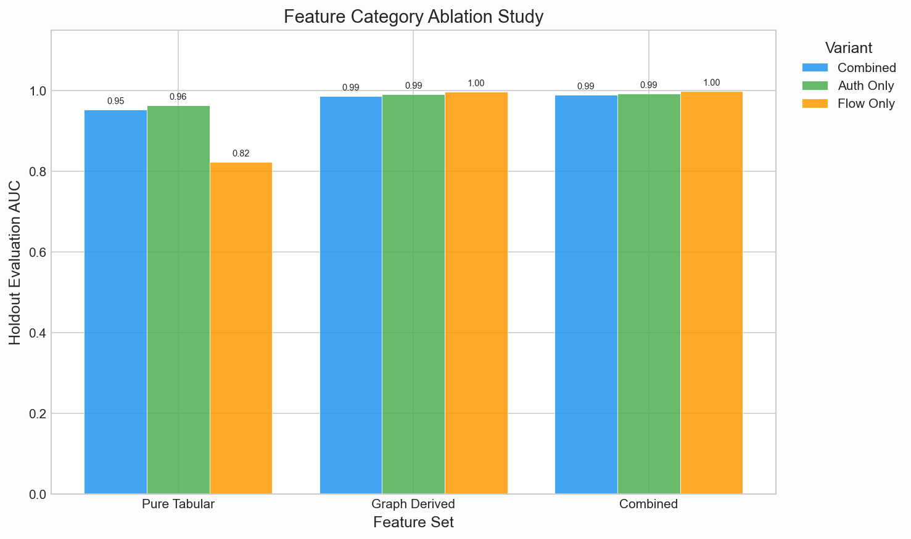

## Slide 1: Title

### Slide content
Real-Time Detection of Lateral Movement in Cloud VPC Networks via Graph-Based Analysis of Flow and Authentication Logs

Ibrahim Pehlivan, Wesley Gunawan, Samyak Kakatur  
ECE 239AS, UCLA

### Speaker notes
- Lateral movement = post-compromise pivoting through internal machines toward high-value targets
- Core question: does combining flow + auth logs in one graph beat either source alone?
- Speaker split: Ibrahim (1–8), Wesley (9–16), Samyak (17–24)

## Slide 2: Main Takeaways: Auth Logs and Graph Features Drive Detection

### Slide content
1. Authentication logs carry the strongest lateral-movement signal.
2. Graph-derived features explain most of the detection lift.
3. Weight optimization generalizes; the main value is interpretable scoring.

### Speaker notes
- These three points are the thread through the whole talk
- Auth-only very strong on LANL; graph features add real discriminative power
- Nelder-Mead value = transparent weighted score, not beating logistic regression

## Slide 3: Internal Telemetry Is Split and Noisy

### Slide content
Internal cloud traffic is noisy, trusted by default, and split across separate telemetry sources.

### Speaker notes
- Flow logs → who connected to whom, but not if malicious vs admin
- Auth logs → logons, but miss recon/service exploitation w/o login
- Perimeter IDS → mostly north-south; lateral movement is east-west inside VPC

## Slide 4: We Test Whether Graph Fusion Beats Single-Source Baselines

### Slide content
Can graph-based analysis of combined flow and authentication logs detect lateral movement better than single-source or tabular baselines?

### Speaker notes
- Original proposal: low latency + real-time
- Implemented scope: LANL-2015 evaluation
- Build graph variants (flow-only, auth-only, combined) → compare vs tabular baselines on aligned metrics

## Slide 5: Prior Work Motivates Graphs; Our Test Fuses Auth and Flow

### Slide content
- Prior work detects paths, provenance, temporal links, or alert context.
- Our angle: unified auth + flow graph with interpretable edge/path scoring.

### Speaker notes
- Hopper → login-graph path detection
- Euler → temporal graph modeling
- POIROT → provenance graphs, but needs known attack templates
- HOLMES → multi-log kill-chain correlation
- Kitsune / NoDoze → flow-feature baselines + rarity-based triage
- Our angle: unified auth + flow graph → source ablations + tabular baselines on lateral-movement pairs

## Slide 6: We Detect Post-Compromise Pivots, Not Initial Access

### Slide content
Assume one machine is already compromised; detect the pivoting behavior that follows.

### Speaker notes
- Attacker actions: scan hosts, reuse creds, SSH/RDP, SMB, exploit services
- Goal: NOT initial access → detect source-dest pairs matching red-team lateral movement post-foothold

## Slide 7: All Reported Results Use LANL-2015 Only

### Slide content
LANL-2015 only: 58 days, 1.6B+ events, 749 red-team events, 308 attack pairs.

### Speaker notes
- 58 days, 1.6B+ events, 749 red-team events, 308 unique red-team src-dst pairs
- Pipeline scopes ±3600s around red-team events → 25 overlapping intervals → streams only those windows
- Every experiment/figure = LANL-only

## Slide 8: The Graph Unifies Machines, Users, Auth Events, and Flows

### Slide content
Computers and users become nodes; auth events and flow records become directed edges.

### Speaker notes
- Auth records → computer-to-computer edges; user fields → user-to-user metadata edges
- Flow records → computer-to-computer edges w/ protocol, ports, packets, bytes, duration, timestamps
- Duplicate src-dst events → increment edge weight (not separate edges)

## Slide 9: Source Ablations Separate Fusion From Single-Source Signal

### Slide content
- `combined`: authentication + flow edges
- `auth_only`: authentication edges only
- `flow_only`: flow edges only

### Speaker notes
- If combined wins → multi-source correlation matters
- If auth-only wins → auth semantics dominate
- If flow-only weak → network connectivity alone insufficient for this dataset

## Slide 10: Features Span Connection, Host, and Network Behavior

### Slide content
23 unique features across connection, host, and network levels.

### Speaker notes
- Connection: edge rarity, NTLM, network logon, auth success, LM ports, protocol rarity, byte/packet ratio, duration
- Host: degree, fan-out ratio, betweenness, inter-arrival stats, burst score, active duration
- Network: density, clustering, components, node count, edge count

## Slide 11: NTLM and Graph Degree Dominate Single-Feature Signal

### Slide content
  
  

- How to read: x-axis = ROC AUC; y-axis = candidate feature; each panel is one graph variant; dashed 0.5 = random ranking.
- Takeaway: NTLM/network-logon semantics and destination degree are the strongest single-feature signals.

### Speaker notes
- AUC = P(red-team edge scores > benign edge); 1.0 = perfect, 0.5 = random (dashed line)
- Top combined features: `is_ntlm` 0.933, `dst_in_degree` 0.819, `is_network_logon` 0.817, `dst_total_degree` 0.812, `edge_rarity` 0.809
- Key insight: auth semantics + graph structure = right signal family (not one silver-bullet feature)

## Slide 12: Nelder-Mead Makes the Score Interpretable

### Slide content
Nelder-Mead learns feature weights by maximizing ROC AUC over labeled red-team pairs.

### Speaker notes
- Not hand-tuned weights → derivative-free Nelder-Mead simplex search over weighted sum
- Non-binary features → percentile-ranked (reduce outlier influence)
- Binary features → pass through unchanged

## Slide 13: Edge Scores Are Weighted Sums Over Audited Features

### Slide content
`s = Σ wᵢ* · fᵢ`

### Speaker notes
- Combined: `is_ntlm`, `dst_in_degree`, `is_network_logon`, `dst_total_degree`, `edge_rarity`
- Auth-only: `src_in_degree`, `is_ntlm`, `src_out_degree`
- Flow-only: `src_burst_score`, `dst_inter_arrival_mean`, `dst_inter_arrival_std`
- `wᵢ*` = optimized weight (not hand-picked)
- User-account edges + self-loops → score 0 (no red-team signal)

## Slide 14: Path Boosting Adds Multi-Hop Context

### Slide content
Single suspicious edges are not enough; lateral movement is often multi-hop.

### Speaker notes
- BFS up to 4 hops, follow top 10 outgoing edges/node by edge score
- Path score = avg of: geometric mean, max edge score, arithmetic mean
- Top 50 paths kept → edges in those paths get 0.1 × path-score boost (capped at 1.0)

## Slide 15: Thresholds Are Chosen in Pair-Space for F1

### Slide content
Sweep percentiles `{90, 95, 97, 99, 99.5, 99.9}` and choose the best F1.

### Speaker notes
- Pair-space metrics: threshold edges → collapse to src-dst pairs → compare vs red-team pairs
- Zero-variance scores → threshold set above max (nothing flagged)

## Slide 16: Baselines Use the Same Feature Vectors for Fair Comparison

### Slide content
Compare graph scoring against One-Class SVM and Isolation Forest on the same edge features.

### Speaker notes
- One-Class SVM: RBF kernel, ν=0.1
- Isolation Forest: 100 trees, contamination="auto", seed 42
- Both: train on normal edges only, eval on held-out normal + red-team edges
- Same threshold optimizer + pair-metric calculator as graph detector

## Slide 17: Combined Graph Ranks Best While Keeping Alert Cost Low

### Slide content
  
  

- How to read: x-axis = graph variant; y-axis = metric score; each panel is one metric (AUC, F1, recall); colors = detector.
- Takeaway: graph scoring gives the best combined-variant AUC; Isolation Forest buys recall with more alert cost.

### Speaker notes
- AUC (top): threshold-independent ranking; P(attack edge > benign edge); higher better, 1.0 perfect
- F1 (mid): harmonic mean of precision + recall; high = catches attacks w/o flooding false alarms
- Recall (bottom): fraction of 308 red-team pairs detected; high = more caught, but flagging everything = recall 1.0 + terrible precision
- Combined graph: AUC 0.959, FPR 0.004 (0.4% benign pairs flagged)
- Isolation Forest: more pairs detected but higher FPR → more analyst burden
- Present as tradeoff, not universal win

## Slide 18: Auth-Only Is Strongest in LANL; Flow-Only Is Not Actionable

### Slide content
Auth-only: AUC 0.984, recall 0.922, FPR 0.006.  
Combined: AUC 0.959, recall 0.211, FPR 0.004.  
Flow-only: AUC 0.963, recall 0.068, FPR 0.030.

### Speaker notes
- Auth-only: 92% recall, 0.6% FPR → strongest single source
- Combined: fewest false alarms (0.4%) but only 21% recall → precise but conservative
- Flow-only: ranks decently (AUC 0.963) but 7% recall + 3% FPR → unusable standalone
- Takeaway: auth semantics drive detection; flow adds noise more than signal on LANL

## Slide 19: Optimized Weights Generalize on Held-Out Edges

### Slide content

- How to read: x-axis = variant; y-axis = AUC; bars = optimizer evaluation, logistic-regression evaluation, optimizer calibration.
- Takeaway: calibration and held-out AUC stay nearly identical, so optimized weights are not just memorizing.

### Speaker notes
- 50/50 split: calibration (fit weights) vs evaluation (held-out, never seen)
- Calibration AUC 0.9646 vs eval AUC 0.9630 → gap 0.17%
- Equal-weight baseline ~0.9101 → optimized weights +5.4 pts w/ no held-out penalty
- Confirms generalization, not overfitting

## Slide 20: Logistic Regression Matches Nelder-Mead, So Features Drive Lift

### Slide content
Nelder-Mead eval AUC: 0.9630.  
Logistic regression eval AUC: 0.9624.

### Speaker notes
- NM eval AUC 0.9630 vs LR eval AUC 0.9624 → diff 0.0006 = noise
- Takeaway: optimizer choice barely matters
- NM = interpretable scoring mechanism aligned w/ project formula, not a novel learner

## Slide 21: Graph Features Explain Most of the AUC Gain

### Slide content

- How to read: x-axis = feature family; y-axis = evaluation AUC; colors = graph variant.
- Takeaway: graph-derived features outperform pure tabular features and explain most of the gain.

### Speaker notes
- Tabular-only features: eval AUC 0.9529
- Graph-derived only: 0.9867
- Both combined: 0.9904
- Adding graph features on top of tabular: +0.0375 AUC
- Adding tabular on top of graph: +0.0037 only
- Strongest evidence: representation drives results, not optimizer choice

## Slide 22: Representation Matters More Than Optimizer Choice

### Slide content
Detection lift comes from feature representation more than the optimizer.

### Speaker notes
- Tabular supervised learning: baseline contribution
- Graph-derived local features: +~0.037 AUC
- Label-free multi-hop features: +~0.015
- Known-attacker propagation: +~0.036 (only w/ compromised seed known)

## Slide 23: Lots of Future Work Left to be Done

### Slide content
- Runtime and scalability: latency, throughput, CPU/memory profiling on stream-scale data.
- New datasets: evaluate on cloud-native VPC flow logs (AWS VPC Flow, Azure NSG, GCP VPC) to test generalization beyond LANL.
- Industry partnership: collaborate with a cloud provider for real deployment telemetry and live red-team exercises.
- Streaming graph: incremental graph updates instead of batch rebuilds for true real-time detection.
- Adaptive thresholds: drift-aware threshold tuning as network baseline shifts over time.

### Speaker notes
- LANL-only → biggest gap: no modern cloud eval (AWS/Azure/GCP VPC flow logs)
- Cloud provider partnership → real VPC telemetry + controlled red-team exercises
- No latency/throughput measured yet; pipeline is batch → need ingest-to-alert profiling
- Incremental graph updates needed for true real-time
- Fixed thresholds may drift as network behavior evolves → adaptive/drift-aware methods

## Slide 24: Conclusion: Auth Semantics and Graph Features Drive Detection

### Slide content
1. Authentication logs carry the strongest lateral-movement signal.
2. Graph-derived features explain most of the detection lift.
3. Weight optimization generalizes; the main value is interpretable scoring.

### Speaker notes
- Restate Slide 2 takeaways
- Claim is NOT "combined logs always win"
- Precise claim: graph-based representations of auth + flow expose relational patterns tabular methods miss; auth semantics dominate this LANL eval
