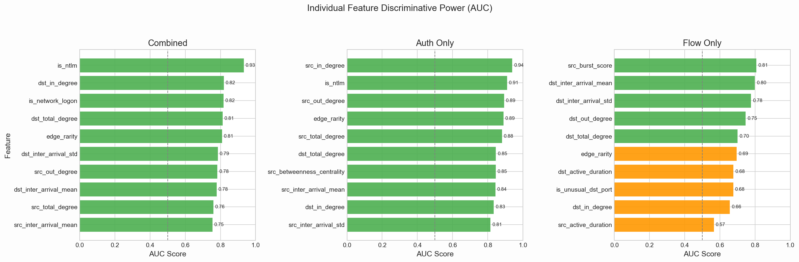
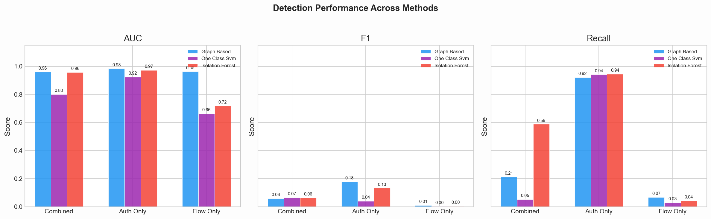
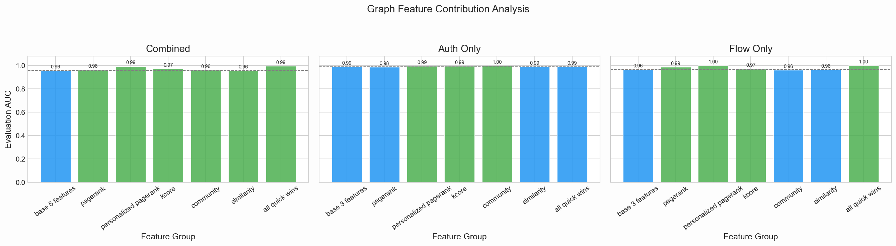

## Slide 1: Title

### Slide content
Real-Time Detection of Lateral Movement in Cloud VPC Networks via Graph-Based Analysis of Flow and Authentication Logs

Ibrahim Pehlivan, Wesley Gunawan, Samyak Kakatur  
ECE 239AS, UCLA

### Speaker notes
Open with the core framing: lateral movement happens after initial compromise, when an attacker pivots through internal machines toward higher-value targets. The project asks whether combining network flow logs and authentication logs inside one graph improves detection compared with using either source alone.

## Slide 2: Main Takeaways

### Slide content
1. Authentication logs carry the strongest lateral-movement signal.
2. Graph-derived features explain most of the detection lift.
3. Weight optimization generalizes; the main value is interpretable scoring.

### Speaker notes
These are the three points to keep returning to. The combined graph is the main system, but the experiments show a sharper nuance: auth-only is extremely strong on LANL, graph features add substantial discriminative power, and Nelder-Mead is useful mainly because it gives a transparent weighted score rather than because it beats logistic regression.

## Slide 3: Why Lateral Movement Is Hard

### Slide content
Internal cloud traffic is noisy, trusted by default, and split across separate telemetry sources.

### Speaker notes
Flow logs show who connected to whom, but not whether the connection was an attacker session or normal administration. Authentication logs show logons, but miss reconnaissance or service exploitation that never creates a login event. Perimeter IDS also sees mostly north-south traffic, while lateral movement is east-west inside the VPC.

## Slide 4: Research Question

### Slide content
Can graph-based analysis of combined flow and authentication logs detect lateral movement better than single-source or tabular baselines?

### Speaker notes
The original proposal emphasized low latency and real-time processing. The implemented report centers on LANL-2015 evaluation: build graph variants from flow-only, auth-only, and combined logs, then compare them with unsupervised tabular anomaly detectors using aligned metrics.

## Slide 5: Positioning Against Prior Work

### Slide content
- Prior work detects paths, provenance, temporal links, or alert context.
- Our angle: unified auth + flow graph with interpretable edge/path scoring.

### Speaker notes
Use this slide to make the paper-presentation framing clearer. Hopper motivates login-graph path detection; Euler motivates temporal graph modeling; POIROT motivates provenance graphs but relies on known attack templates; HOLMES motivates multi-log kill-chain correlation. Kitsune and NoDoze motivate flow-feature baselines and rarity-based triage. Our difference is combining authentication and flow telemetry in one graph, then evaluating source ablations and tabular baselines on lateral-movement pairs.

## Slide 6: Threat Model

### Slide content
Assume one machine is already compromised; detect the pivoting behavior that follows.

### Speaker notes
The attacker may scan internal hosts, reuse credentials, SSH or RDP into machines, use SMB, or exploit services. The goal is not initial access detection. It is detecting source-destination pairs that match red-team lateral movement behavior after foothold.

## Slide 7: Dataset and Scope

### Slide content
Evaluation uses LANL-2015 only.

### Speaker notes
LANL-2015 spans 58 days, 1.6B+ events, 749 red-team events, and 308 unique red-team source-destination pairs across authentication, flow, and red-team files. To avoid loading all events, the pipeline scopes to ±3,600 seconds around red-team events, merges overlaps into 25 intervals, and streams only events inside those windows. The presentation should be clear that every reported experiment and figure is LANL-only.

## Slide 8: Graph Construction

### Slide content
Computers and users become nodes; auth events and flow records become directed edges.

### Speaker notes
Authentication records create computer-to-computer edges, and when user fields exist, user-to-user metadata edges. Flow records create computer-to-computer edges with protocol, ports, packets, bytes, duration, and timestamps. Duplicate source-destination events increment edge weight rather than becoming separate graph edges.

## Slide 9: Three Graph Variants

### Slide content
- `combined`: authentication + flow edges
- `auth_only`: authentication edges only
- `flow_only`: flow edges only

### Speaker notes
These variants answer the key source-ablation question. If combined wins, multi-source correlation matters. If auth-only wins, authentication semantics dominate. If flow-only is weak, network connectivity alone is not enough for this dataset.

## Slide 10: Feature Families

### Slide content
23 unique features across connection, host, and network levels.

### Speaker notes
Connection features include edge rarity, NTLM, network logon, auth success, lateral-movement ports, protocol rarity, byte-per-packet ratio, and duration. Host features include degree, fan-out ratio, betweenness, inter-arrival statistics, burst score, and active duration. Network features include density, clustering, components, node count, and edge count.

## Slide 11: Feature Audit

### Slide content

### Speaker notes
Use the figure alone on the slide. The audit ranks each candidate feature by held-out ROC AUC. Top combined-variant features are `is_ntlm` at 0.933, `dst_in_degree` at 0.819, `is_network_logon` at 0.817, `dst_total_degree` at 0.812, and `edge_rarity` at 0.809. This supports the story that auth semantics plus graph structure matter.

## Slide 12: Weight Optimization

### Slide content
Nelder-Mead learns feature weights by maximizing ROC AUC over labeled red-team pairs.

### Speaker notes
Drafts supersede the final report here. The final approach is not hand-tuned feature weights. It uses a derivative-free Nelder-Mead simplex search over a weighted sum. Non-binary features are percentile-ranked to reduce outlier influence; binary features pass through unchanged.

## Slide 13: Edge Scoring Formula

### Slide content
`s = Σ wᵢ* · fᵢ`

### Speaker notes
For the combined variant, the selected features are `is_ntlm`, `dst_in_degree`, `is_network_logon`, `dst_total_degree`, and `edge_rarity`. Auth-only uses `src_in_degree`, `is_ntlm`, and `src_out_degree`. Flow-only uses `src_burst_score`, `dst_inter_arrival_mean`, and `dst_inter_arrival_std`. User-account edges and self-loops receive score 0 because they carry no red-team signal in the labeled data.

## Slide 14: Path Scoring

### Slide content
Single suspicious edges are not enough; lateral movement is often multi-hop.

### Speaker notes
The pipeline enumerates paths up to 4 hops with BFS, following only the top 10 outgoing edges per node by edge score. Each path score averages three views: geometric mean, maximum edge score, and arithmetic mean. The top 50 paths are kept, and edges in those paths receive a 0.1 × path-score boost capped at 1.0.

## Slide 15: Threshold Selection

### Slide content
Sweep percentiles `{90, 95, 97, 99, 99.5, 99.9}` and choose the best F1.

### Speaker notes
Metrics are computed in pair-space: after thresholding edges, anomalous edges collapse into source-destination pairs and are compared with red-team pairs. If all edge scores have zero variance, the threshold is set above the maximum score so no edges are flagged.

## Slide 16: Baseline Protocol

### Slide content
Compare graph scoring against One-Class SVM and Isolation Forest on the same edge features.

### Speaker notes
One-Class SVM uses an RBF kernel with `nu=0.1`; Isolation Forest uses 100 trees, `contamination="auto"`, seed 42. Both train only on normal edges, evaluate on held-out normal edges plus red-team edges, and use the same threshold optimizer and pair-metric calculator as the graph detector.

## Slide 17: Main Method Comparison

### Slide content

### Speaker notes
Use the figure alone on the slide. The draft result summary says the combined graph method achieves the highest AUC at 0.959 with the lowest false positive rate at 0.004. Isolation Forest detects more red-team pairs in the combined setting, but with much higher false positive rate. The graph method is better when alert volume matters.

## Slide 18: Variant Results

### Slide content
Auth-only: AUC 0.984, recall 0.922, FPR 0.006.  
Combined: AUC 0.959, recall 0.211, FPR 0.004.  
Flow-only: AUC 0.963, recall 0.068, FPR 0.030.

### Speaker notes
This is the most important nuanced result. Authentication-only catches most red-team pairs in LANL because NTLM and network-logon behavior are highly informative. Combined has the lowest false positive rate but lower recall at its selected threshold. Flow-only can rank some edges well but has poor operating-point recall, making it weak as a standalone detector.

## Slide 19: Weight Validation

### Slide content

### Speaker notes
Use the figure alone on the slide. The held-out split has calibration AUC 0.9646 and evaluation AUC 0.9630, a gap of only 0.0016 or 0.17%. The equal-weight baseline is about 0.9101, so optimized weights improve ranking without a meaningful held-out penalty.

## Slide 20: Nelder-Mead vs Logistic Regression

### Slide content
Nelder-Mead eval AUC: 0.9630.  
Logistic regression eval AUC: 0.9624.

### Speaker notes
The supervised linear method barely changes the outcome. Logistic regression and Nelder-Mead agree within single-seed noise. So the optimizer should be presented as an interpretable scoring mechanism aligned with the project’s formula, not as a novel learner outperforming standard supervised models.

## Slide 21: Feature Ablation

### Slide content

### Speaker notes
Use the figure alone on the slide. Pure tabular features reach eval AUC 0.9529. Graph-derived features alone reach 0.9867. Combined features reach 0.9904. Adding graph-derived features on top of tabular raises eval AUC by 0.0375, while adding tabular features on top of graph features adds only 0.0037.

## Slide 22: Multi-Hop Feature Sweep

### Slide content

### Speaker notes
Use the figure alone on the slide. Personalized PageRank seeded at known compromised host `C17693` gives the largest gain, but it is conditional because production would need a known compromised seed first. Label-free multi-hop features such as k-core and Louvain communities add smaller, defensible gains. Standard PageRank and Jaccard/Adamic-Adar contribute little here.

## Slide 23: What Actually Drives Detection

### Slide content
Detection lift comes from feature representation more than the optimizer.

### Speaker notes
The evaluation decomposes the improvement. Supervised learning on tabular features is one contribution. Graph-derived local features add another roughly +0.037 AUC. Label-free multi-hop features add a modest +0.015. Known-attacker propagation can add +0.036, but only when a compromised seed is known.

## Slide 24: Limitations and Deployment Cautions

### Slide content
LANL is one environment; deployment metrics remain revision items.

### Speaker notes
The feature audit depends on LANL red-team labels, so the selected set should be rechecked on held-out LANL windows during revision. LANL attacks emphasize SMB, SSH, credential reuse, and reconnaissance, so the current claims should stay scoped to LANL-2015. Proposed paper items such as latency, throughput, CPU and memory overhead, and direct related-work metric comparisons should be framed as future revision work. Personalized PageRank should be framed as post-detection scoping, not cold-start detection.

## Slide 25: Conclusion

### Slide content
1. Authentication logs carry the strongest lateral-movement signal.
2. Graph-derived features explain most of the detection lift.
3. Weight optimization generalizes; the main value is interpretable scoring.

### Speaker notes
Restate the same takeaways from Slide 2. The project’s strongest claim is not simply “combined logs always win.” The more precise claim is that graph-based representations of auth and flow telemetry expose relational patterns that tabular methods miss, while auth semantics dominate this LANL evaluation.
